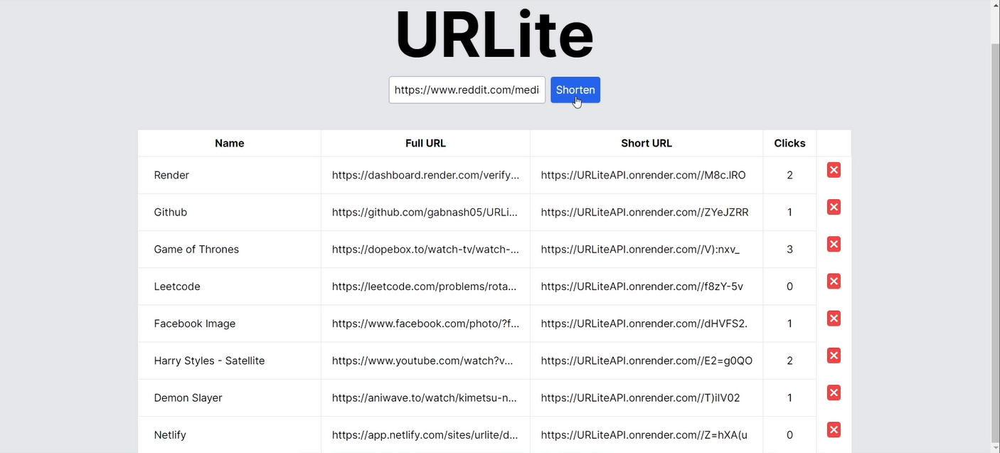

# URLite Frontend

URLite is a URL shortening service that allows users to shorten long URLs, track the number of clicks, and manage their shortened URLs. The frontend is built using React and Vite.

## Features

- Shorten long URLs
- Track the number of clicks on shortened URLs
- Edit the name of shortened URLs
- Delete shortened URLs

___


## Getting Started

### Prerequisites

- Node.js

### Installation

1. Clone the repository:

   ```sh
   git clone https://github.com/yourusername/URLite.git
   cd URLite
   ```

2. Install Dependencies

    ```sh
    npm install
    ```

### Running the Application

1. Start the development server:

    ``` sh
    npm run dev
    ```

2. Open your browser and navigate to http://localhost:3000 to use the application.
